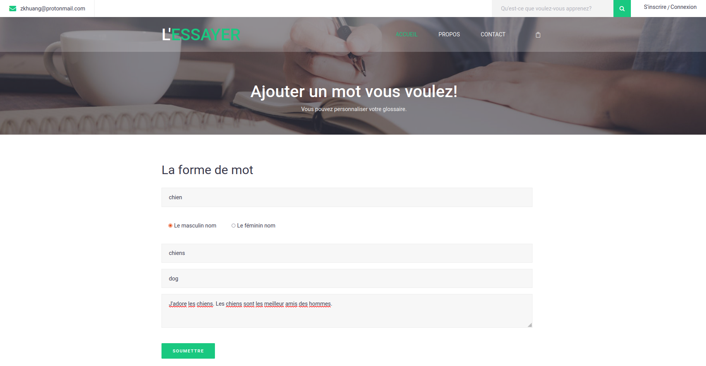

# 

**Notice: This is just a demonstrated project but strive to reach the criteria of a Minimum viable product.**

L'ESSAYER is an interactive on-line French learning system to help French beginner learn with an amiable way.

See the following contents to discover more!

## Tablet of contents
* [Introduction](#introduction)
* [Illustrations](#illustrations)
* [Launch](#launch)
* [Project status](#project-status-and-room-for-improvement)
* [Sources](#sources)
* [Acknowledgement](#acknowledgement)
* [Contact](#contact)

## Introduction

L'ESSAYER is an on-line French learning system that is designed for a French beginner. Some specialized features are as follows:

- [x] User customized vocabulary
- [x] On-line spelling quiz system for user customized vocabulary

User can construct their own word lists, as the interactive on-line spelling quiz system generates a spelling quiz according to user's own glossary.

This can strengthen the impression of the words entering by the users and achieve the goal to memorize words. L'ESSAYER also provides some common 

French grammar rules which are mostly shown in the format of tables to ensure the learners can quickly master the key points of the grammar rules. 

## Illustrations
- Home page

- Grammar rules page

- Customize vocabulary screen

- Spelling quiz page


## Launch

This project is established by the build tool Gradle and written in Java(JSP + Servlet + MySQL). Before launch this project, one should first modify

the connection to the database. Please replace the connection in the methods saveWordToDatabase(Word word) and loadWordFromDatabase(int questionNum)(Word word).

```

public static boolean saveWordToDatabase(Word word) {
	// TODO Auto-generated method stub
	try {
		Class.forName("com.mysql.cj.jdbc.Driver");
		Connection conn = DriverManager.getConnection(<DATABASE>, <USER>, <PASSWORD>);
		...
}
```
```

public static ArrayList<HashMap<String, String>> loadWordFromDatabase(int questionNum) {
	// TODO Auto-generated method stub
	ArrayList<HashMap<String, String>> questionArray = null;
	try {
		Class.forName("com.mysql.cj.jdbc.Driver");
		Connection conn = DriverManager.getConnection(<DATABASE>, <USER>, <PASSWORD>);
		...
}
```

A sampled database is provided under the directory [database](database). Then, generate the war 

archive with all the compiled classes and deploy the war file to your web application server.

Bonne chance!

## Project status and room for improvement

This is a personal demonstrated project while still some minor(?) defects. See https://github.com/znkaihuang/l-essayer/issues.

Some more advanced improvements are taken into consideration but not implement yet.

- [ ] The user-customized glossary only allows user to add nouns while verbs, adjectives, adverbs, etc., are not supported.
- [ ] The system contains a spelling quiz. This is too limited. Grammar quiz, semantic quiz, etc., can more enrich this system.
- [ ] ...

Some codes need to be refactored. For example, one can find many JSP scriplets in the .jsp files. It is not a wise choice to

use scriplets and should have other better replacement, like JSTL. 

Look forward to refactors and improvements in the futre.

## Sources

The front-end applies the template from [ThemeWagon](https://themewagon.com/) [Ezuca](https://themewagon.com/themes/free-html5-education-template-ezuca/).

## Acknowledgement

## Contact

zkhuang@protonmail.com