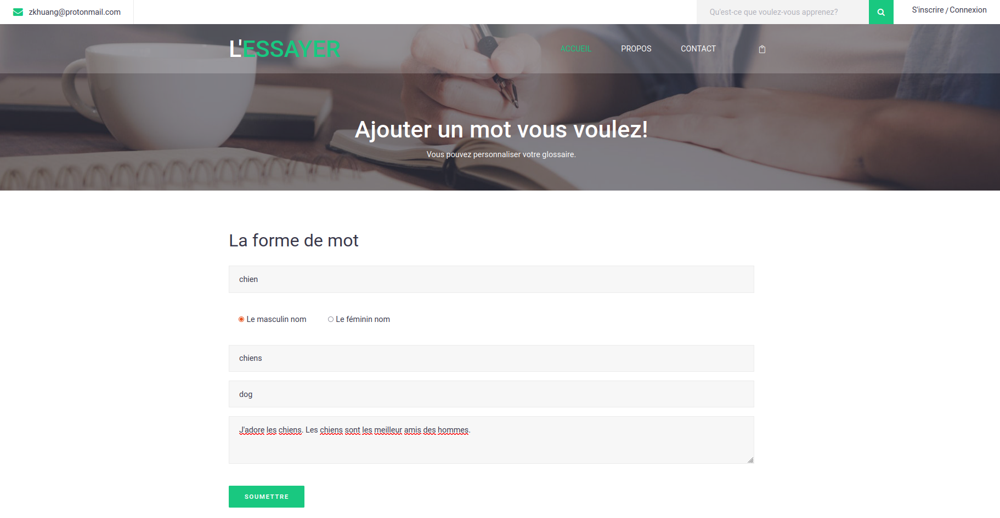

# 

**Notice: This is just a demonstrated project but strive to reach the criteria of a Minimum viable product.**

L'ESSAYER is an interactive on-line French learning system to help French beginner learn with an amiable way.

See the following contents to discover more!

## Tablet of contents
* [Introduction](#introduction)
* [Illustrations](#illustrations)
* [Launch](#launch)
* [Project status](#project-status)
* [Sources](#sources)
* [Room for Improvement](#room-for-improvement)
* [Acknowledgement](#acknowledgement)
* [Contact](#contact)

## Introduction

L'ESSAYER is an on-line French learning system that is designed for a French beginner. Some specialized features are as follows:

- [x] User customized vocabulary
- [x] On-line spelling quiz system for user customized vocabulary

User can construct their own word lists, as the interactive on-line spelling quiz system generates a spelling quiz according to user's own glossary.

This can strengthen the impression of the words entering by the users and achieve the goal to memorize words. L'ESSAYER also provides some common 

French grammar rules which are mostly shown in the format of tables to ensure the learners can quickly master the key points of the grammar rules. 

## Illustrations

## Launch

## Project status

## Sources

## Room for Improvement

## Acknowledgement

## Contact